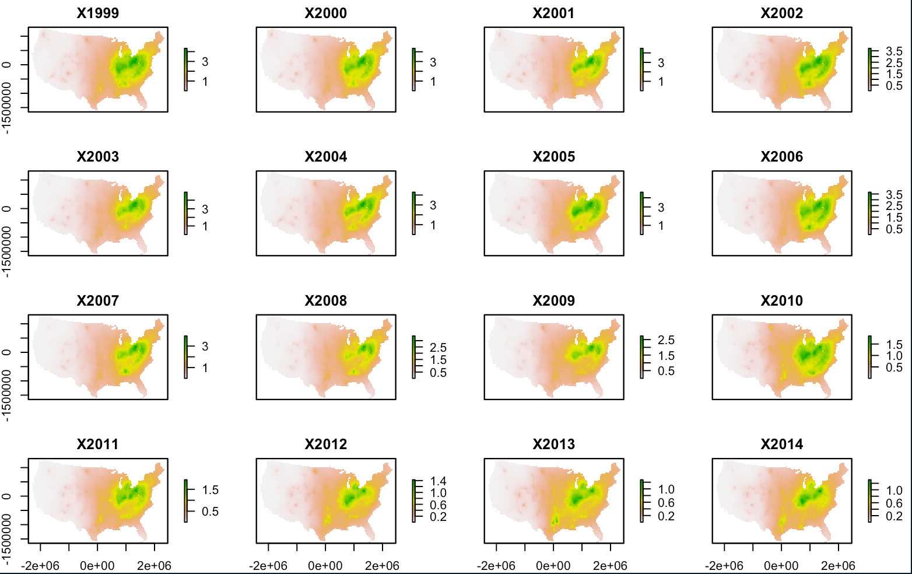
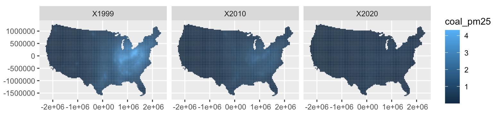

# Introduction
This repository describes data maintained for public use from the manuscript "22 years of PM2.5 coal source impacts with the HyADS model" by L. Henneman et al. (in review). The data is stored on an [Open Science Framework project site](https://osf.io/8gdau/?view_only=8c4d01e3187f409ea4da93c292e33e1b).

## Available data
There are three datasets stored on the OSF page. This repository describes how to read in and manipulate the first two datasets (coal source impacts).
- coal source impacts
  - summed impacts from all units (files named in the format "grids_pm25_total_YYYY.fst")
  - impacts from each coal unit (files named in the format "grids_pm25_byunit_YYYY.fst")
- formatted data on coal facility attributes from the [US EPA's Air Markets Program Database](https://ampd.epa.gov/ampd/) (coal_unit_scrubber_operation.csv)

## Data storage format
The coal source impacts data is stored as compressed `.fst` files ([fst is an R package](https://www.fstpackage.org/). 

The source impacts data is gridded with a 36km resolution. We use the following coordinate reference system projection:
```
#coordinate reference system projection string for spatial data
p4s <- "+proj=lcc +lat_1=33 +lat_2=45 +lat_0=40 +lon_0=-97 +a=6370000 +b=6370000"
```

## Reproducilibity using renv
To ensure packages and formats are consistent, we have used the [renv package](https://rstudio.github.io/renv/articles/renv.html). To use the same packages used to create these data: 
1) install the renv package (`install.packages('renv')`)
2) download the `renv.lock` file from this repository to your working directory
3) run `renv::restore()` in your R console

# Download the files
To retrieve the files,  download the files directly from the [OSF site](https://osf.io/8gdau/?view_only=8c4d01e3187f409ea4da93c292e33e1b). 

# Reading in the files
To read the files into R, execute the following. First, load the libraries we'll use.
```
library( fst)
library( data.table)
library( magrittr)
library( raster)
library( sf)
library( ggplot2)
```

Next, define the `source_impacts_dir` as the location to which you saved the files.
```
source_impacts_dir <- '/Your/Source/Impacts/Directory'

```

## Total coal PM2.5 source impacts
The following code will read in total source impacts, i.e., the summed source impacts from all coal units.
```
# get the names of the gridded HyADS output files from the data directory
grid.files.yr <- list.files( source_impacts_dir,
                             pattern = 'grids_pm25_total_\\d{4}\\.fst',
                             full.names = TRUE)

# read select files and combine into single data.table
grid.dat <- lapply( grid.files.yr,
                    function( f){
                      year.f <- gsub( '^.*_|\\.fst', '', f)
                      
                      in.f <- read.fst( f, as.data.table = T)
                      setnames( in.f, 'V3', 'coal_pm25')
                      in.f[, year := year.f]
                    }) %>% rbindlist

# summarize the data
summary( grid.dat)

```

## Unit coal PM2.5 source impacts
These files are substantially larger, as the files contain each coal unit' is assigned coal's source impacts in each location in each year. The resulting data.table object has a row for each grid cell-year combination and a column for X/Y locations and each coal unit. 
```
# get the names of the gridded HyADS output files
grid.files.unit.yr <- list.files( source_impacts_dir,
                                  pattern = 'grids_pm25_byunit_\\d{4}\\.fst',
                                  full.names = TRUE)

# read select files
grid.unit.dat <- lapply( grid.files.unit.yr,
                         function( f){
                           print( f)
                           year.f <- gsub( '^.*_|\\.fst', '', f) %>%
                             as( 'integer')
                           
                           in.f <- read.fst( f, as.data.table = T)
                           in.f[, year := year.f]
                           
                           in.f[ is.na( in.f)] <- 0
                           return (in.f)
                         }) %>% rbindlist( fill = T)


# check the dimensions
dim( grid.unit.dat)

```

# Converting coal impacts to spatial objects
The following code uses R's raster package to convert the input data to spatial objects. In the second step, raster objects are converted to simple features objects.

## Spatial impacts as rasters
The following converts the total source impacts data to a raster object
```
# first, use dcast to get year columns
grid.dat.c <- dcast( grid.dat, x + y ~ year, value.var = 'coal_pm25')

# convert to raster
grid.dat.r <- rasterFromXYZ( grid.dat.c, crs = p4s)

# plot, which will show only ~16 of the years contained in grid.dat.r
plot( grid.dat.r)

```



## Spatial impacts as sf objects
(Simple features objects)[https://r-spatial.github.io/sf/] have nice properties for some applications, and they play nicely with ggplot. Here is an example of code to create simple features objects from the data:
```
# create sf object
grid.dat.sf <- rasterToPolygons( grid.dat.r) %>%
                st_as_sf()

# convert object to data.table and melt across years
grid.dat.sf.dt <- data.table( grid.dat.sf)
grid.dat.sf.m <- melt( grid.dat.sf.dt, 
                       id.vars = 'geometry',
                       variable.name = 'year',
                       value.name = 'coal_pm25')

# plot 4 years of data
ggplot( grid.dat.sf.m[year %in% c( 'X1999', 'X2010', 'X2020')]) + 
  geom_sf( aes( fill = coal_pm25, 
                geometry = geometry),
           color = NA) +
  facet_wrap( . ~ year)

```



